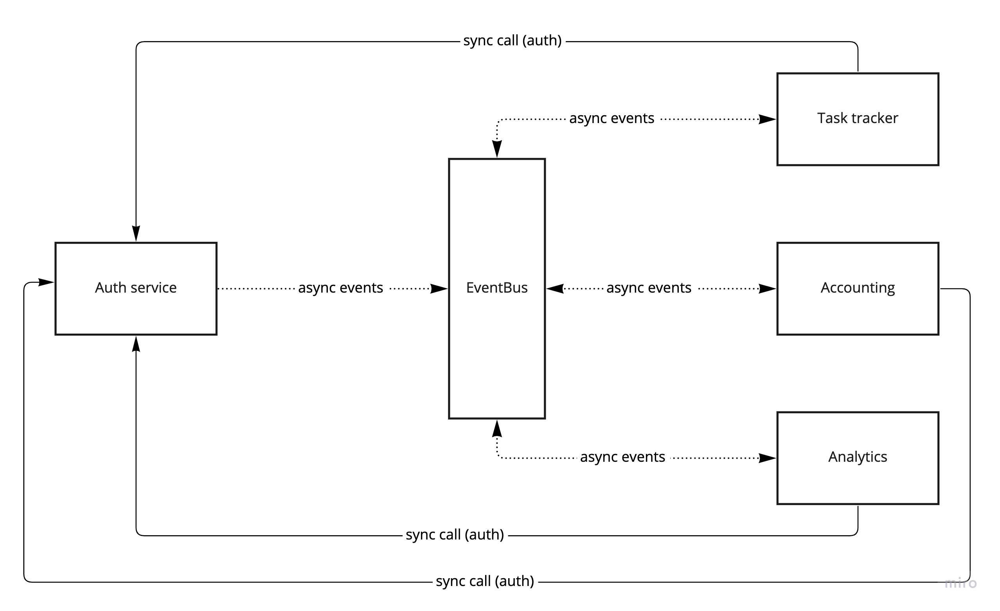

# Урок 0

## Описание дизайна взаимодействия сервисов

### Сервис аутентификации (Auth service)
* Хранение информации о зарегистрированных пользователях (фио, роль).
* Предоставление API для аутентификации в других сервисах.
* Отправка асинхронных событий:
    * Регистрация (создание) пользователя.
    * Изменении данных пользователя.

### Сервис задач (Task tracker)
* Хранение информации о задачах (описание, статус, исполнитель)
* Слушание асинхронных событий:
    * Регистрация (создание) пользователя.
    * Изменении данных пользователя (роль).
* Отправка асинхронных событий:
    * Созадние задачи (уже с исполнителем).
    * Переназначение исполнителя.
    * Выполнение задачи (перевод статуса).

### Сервис бухгалтерии (Accounting)
* Хранение информации:
    * Стоимость задачи (задача, сумма списания при назначении задачи, сумма начисления при выполнении задачи).
    * Начислениях/списаниях по задачам (исполнитель, задача, сумма, операция выплаты).
    * Выплаты исполнителю (исполнитель, дата/время, сумма).
    * Баланс исполнителя (исполнитель, дата, баланс).
* Слушание асинхронных событий:
    * Регистрация (создание) пользователя.
* Отправка асинхронных событий:
    * Выполнение задачи (с суммами начисления/списания).
    * Выплата исполнителю.
    * Изменение баланса исполнителя.

### Сервис аналитики (Analytics)
* Хранение информации:
    * Выплаты за день.
    * Отицательный баланс исполнителя.
    * Стоимость выполненных задач (задача, суммы, дата).
* Слушание асинхронных событий:
    * Регистрация (создание) пользователя.
    * Выполнение задачи (с суммами начисления/списания).
    * Выплата исполнителю.
    * Изменение баланса исполнителя.
