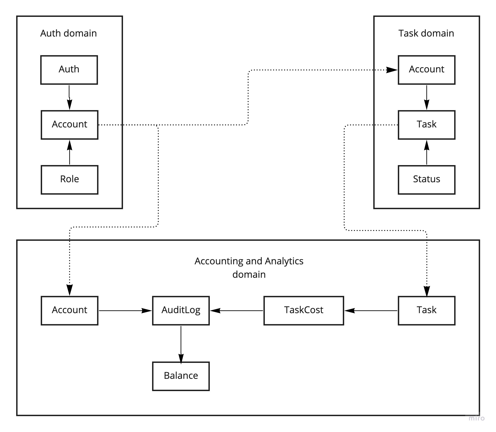
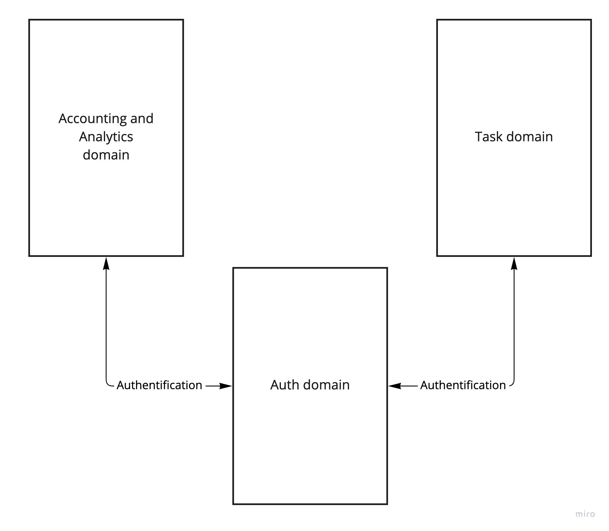
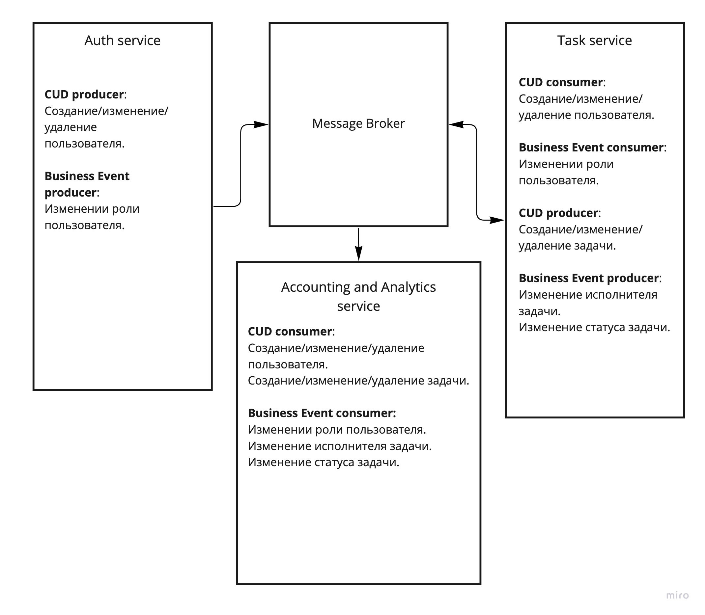

# Домены, сервисы и коммуникация между ними

> CUD &mdash; create/update/delete.

## Содержание
1. [Определение доменов и моделей данных](#domains_and_models)
1. [Описание дизайна сервисов и их взаимодействие](#design)
    1. [Сервис аутентификации (Auth service)](#design_auth)
    1. [Сервис задач (Task tracker)](#design_task_tracker)
    1. [Сервис бухгалтерии и аналитики (Accounting and Analytics)](#design_accounting_and_analytics)

---
---

## Домены и модели данных 

### Домен аутентификации

Модели данных:
* Учетная запись пользователя.
* Данные аутентификации.

Зависимые модели данных из других доменов отсутствуют.

### Домен задач

Модели данных:
* Задача.

Зависимые модели данных из других доменов:
* Учетная запись пользователя.

### Домен бухгалтерии и аналитики

Модели данных:
* Стоимость задач.
* Журнал начислений/списаний по задачам.
* Баланс пользователя.

Зависимые модели данных из других доменов:
* Учетная запись пользователя.
* Задача.

---
---

## Описание дизайна сервисов и их взаимодействие

### Сервис аутентификации (Auth service) 
* Хранение информации о зарегистрированных пользователях (фио, роль).
* Сихронное взаимодействие:
    * Предоставление механмизма аутентификации для других сервисов.
* Асинхронное взаимодействие:
    * CUD producer: Создание/изменение/удаление пользователя.
    * Business Event producer: Изменении роли пользователя.

### Сервис задач (Task tracker) 
* Хранение информации о задачах (описание, статус, исполнитель)
* Сихронное взаимодействие:
    * Использование сервиса аутентификации.
* Асинхронное взаимодействие:
    * CUD consumer: Создание/изменение/удаление пользователя.
    * Business Event consumer: Изменении роли пользователя.
    * CUD producer: Создание/изменение/удаление задачи.
    * Business Event producer: Изменение исполнителя задачи.
    * Business Event producer: Изменение статуса задачи.

### Сервис бухгалтерии и аналитики (Accounting and Analytics) 
* Хранение информации:
    * Стоимость задачи.
    * Начислениях/списаниях по задачам.
    * Баланс исполнителя.
* Сихронное взаимодействие:
    * Использование сервиса аутентификации.
* Асинхронное взаимодействие:
    * CUD consumer: Создание/изменение/удаление пользователя.
    * Business Event consumer: Изменении роли пользователя.
    * CUD consumer: Создание/изменение/удаление задачи.
    * Business Event consumer: Изменение исполнителя задачи.
    * Business Event consumer: Изменение статуса задачи.

---

### Схема синхронного взаимодействия сервисов

---

### Схема асинхронного взаимодействия сервисов

